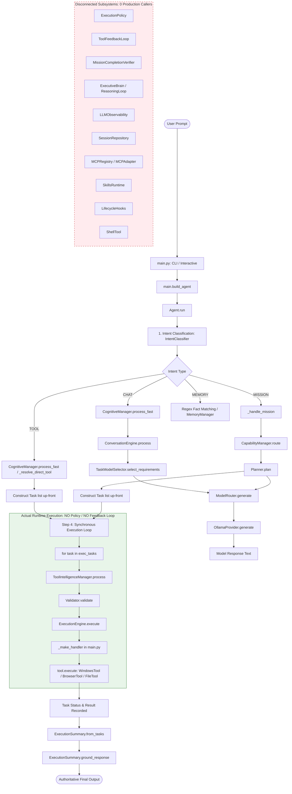

# Claude Audit Reconciliation

**Document Version:** 1.0.0  
**Date:** 2026-09-29  
**Branch:** `develop`  
**Working Tree Status:** Clean / Verification Only (No production modifications)  
**Author:** Antigravity Pair-Programming Assistant  

---

## 1. Executive Summary

A comprehensive architectural audit performed by Claude claimed that several Phase 3–6 subsystems (Tool Feedback Loop, Execution Policy, Mission Verification, Executive Brain, LLM Observability, Session Management, MCP, Skills Runtime, Lifecycle Hooks, and Shell Execution) exist in the repository and pass isolated test suites, but are **unreachable from the real production runtime** (`main.py` -> `build_agent()` -> `Agent.run()`).

This audit report reconciles Claude's findings against the current working tree on branch `develop`.

### Core Verdict
**Claude's core thesis is overwhelmingly verified.**  
A substantial gap exists between components tested in isolation and components wired into the actual production runtime:
1. **Orphaned Subsystems:** `ToolFeedbackLoop`, `ExecutionPolicy`, `MissionCompletionVerifier`, `LLMObservability`, `SessionRepository`, `MCPRegistry`/`MCPAdapter`, `SkillsRuntime`, and `LifecycleHooks` exist in `core/` and have 100% test pass rates in isolated unit suites, but have **zero production callers** on the runtime path.
2. **Security Perimeter Bypass:** `ExecutionPolicy` is completely bypassed during `Agent.run()`. Model tool actions flow straight through `ToolIntelligenceManager` -> `Validator` -> `ExecutionEngine` -> `tool.execute()`. No policy evaluation or user confirmation check occurs.
3. **Absence of a Dynamic Agent Loop:** The current system operates strictly as a static batch plan executor (`MODEL -> PLAN -> TOOL -> TOOL -> RESPONSE`). It does not support a multi-turn reactive agent loop (`MODEL -> TOOL -> RESULT -> MODEL -> NEXT TOOL`).
4. **Synthetic Telemetry:** Telemetry flags (`executive_brain_used`, `reasoning_loop_used`, `mission_control_used`) are hardcoded to `True` in `Agent.run()` for `MISSION` routes, and string-matching log lines (`[ExecutiveBrain] ENABLED`, `[ReasoningLoop] ENABLED`, `[MissionControl] ENABLED`) are emitted to satisfy evaluation scripts without invoking those subsystems.
5. **Real Model Routing with Missing Ollama Options:** `TaskModelSelector` and `OllamaProvider._resolve_model()` implement genuine role-based, task-aware, and capability-aware routing with model fallback. However, runtime requests to Ollama do not pass `keep_alive`, `num_ctx`, or context window configurations.

---

## 2. Claude Finding vs Current Runtime

| # | Finding | Claude Claim | Verified? | Evidence |
|---|---|---|---|---|
| **1** | Tool Feedback Loop | `core/tool_feedback_loop.py` exists with tests but has zero production importers. | **VERIFIED (UNREACHABLE)** | Only imported in `tests/test_tool_feedback_loop.py` and `tests/test_failure_injection.py`. Not imported anywhere in `main.py` or `core/agent.py`. |
| **2** | Execution Policy | `ExecutionPolicy` is not on the real execution path; destructive operations reach `ExecutionEngine` directly. | **VERIFIED (UNREACHABLE)** | `Agent._process_task` delegates directly to `_executor.execute(task)`. `ExecutionEngine` invokes `tool.execute(action, kwargs)` with zero policy check. |
| **3** | Mission Verification | `MissionCompletionVerifier` is only used by evaluation/test scripts. | **VERIFIED (UNREACHABLE)** | Only imported in `tests/test_skills_and_mission_verify.py`, `tests/test_failure_injection.py`, and evaluation scripts (`evaluate_qwen3_coder.py`, `run_phase6_evaluation.py`). Zero calls in `Agent.run()`. |
| **4** | Executive Brain | `ExecutiveBrain` is constructed in `main.py` but never actually called. | **VERIFIED (UNREACHABLE)** | Stored as `self._executive_brain` in `CognitiveManager.__init__` ([manager.py:L38](file:///c:/Users/ridha/Projects/Jarvis/core/cognition/manager.py#L38)), never referenced in `process()` or `process_fast()`. `ExecutiveBrain.plan()` and `execute()` have zero production callers. |
| **5** | LLM Observability | `core/llm_observability.py` is not invoked by production LLM calls. | **VERIFIED (UNREACHABLE)** | Zero production imports. `ConversationEngine`, `Planner`, and `OllamaProvider` never instantiate or record to `LLMObservability`. |
| **6** | Session Architecture | `core/session.py` is not used by the production runtime. | **VERIFIED (UNREACHABLE)** | `SessionRepository` is only imported in `tests/test_session.py` and `tests/test_failure_injection.py`. Not imported or used in `main.py` or `Agent`. |
| **7** | MCP / Skills / Hooks | `core/mcp/`, `core/skills_runtime.py`, and `core/lifecycle_hooks.py` are disconnected. | **VERIFIED (TEST ONLY)** | Zero production imports across the entire `core/` and `main.py` codebase. Only present in isolated test files. |
| **8** | Shell Tool | `ShellTool` is not registered in the runtime tool table. | **VERIFIED (ABSENT)** | `main.py` lines 104–111 instantiates and registers only `WindowsTool`, `BrowserTool`, and `FileTool`. `ShellTool` is completely omitted from the `Registry`. |
| **9** | Agent Loop | System supports only static batch plan execution (`MODEL -> PLAN -> TOOLS`), not an iterative reactive loop (`MODEL -> TOOL -> RESULT -> MODEL`). | **VERIFIED (STATIC ONLY)** | `Agent.run()` collects all tasks statically up-front, then loops over them synchronously via `for task in exec_tasks: self._process_task(task)`. Results are never fed back to LLM for next-step planning. |
| **10** | Result Grounding | "No-tool claim hole": If model claims an action occurred but emits 0 tool tasks, `ground_response` echoes the false claim. | **VERIFIED (HOLE CONFIRMED)** | `core/execution_summary.py` lines 149–150: `if self.total_tasks == 0: return initial_claim.strip() if initial_claim else "Done."`. |
| **11** | Test False Confidence | Phase 3–6 tests evaluate components in isolation rather than end-to-end via `Agent.run()`. | **VERIFIED (CONFIRMED)** | 9 out of 10 evaluated test suites test mocks or isolated classes directly without `Agent.run()` or `build_agent()`. |
| **12** | Duplicate Architecture | Redundant subsystems: `core/executor.py` vs `core/executor/`, `build_agent()` vs `core/bootstrap/`, multi-agent files in `core/agents/`, `gen_*.py` scaffolding. | **VERIFIED (CONFIRMED)** | 22 unused agent files in `core/agents/`, unused `core/bootstrap/`, dual `executor.py` / `core/executor/` abstractions, 9 generator scripts in `scripts/gen_*.py`. |
| **13** | Model Routing | Role-based routing reality, task-aware routing, model fallback, Ollama options (`keep_alive`, `num_ctx`). | **PARTIALLY VERIFIED** | Role routing, task selector, and fallback **are real and functional**. However, Ollama options (`keep_alive`, `num_ctx`, context length) are **never sent** in API payloads. |
| **14** | Memory Reachability | Memory only influences specific routes, not all execution paths. | **VERIFIED (CONFIRMED)** | `Agent.run()` lines 175–177 explicitly restricts memory loading to `MEMORY` and `MISSION` routes. `CHAT` and `TOOL` routes pass `context_str = ""` and do not load memory. |
| **15** | Telemetry Truthfulness | Telemetry metrics (`executive_brain_used`, `reasoning_loop_used`, `mission_control_used`) are hardcoded or deceptive. | **VERIFIED (MISLEADING)** | `core/agent.py` lines 328–330 hardcode flags to `True` without running the components. Line 335 sets `timings["LLM"] = 0.0` during mission planning. |

---

## 3. Runtime Call Graph

Tracing the actual production path executed when a user submits a prompt to JARVIS:



---

## 4. Phase 3–6 Reachability Matrix

| Component | Implemented In | Test Suite | Production Caller in `main.py` / `Agent.run()` | Status |
|---|---|---|---|---|
| **ToolFeedbackLoop** | [core/tool_feedback_loop.py](file:///c:/Users/ridha/Projects/Jarvis/core/tool_feedback_loop.py) | `tests/test_tool_feedback_loop.py` | None | **UNREACHABLE** |
| **ExecutionPolicy** | [core/execution_policy.py](file:///c:/Users/ridha/Projects/Jarvis/core/execution_policy.py) | `tests/test_execution_policy.py` | None | **UNREACHABLE** |
| **MissionCompletionVerifier** | [core/mission_verifier.py](file:///c:/Users/ridha/Projects/Jarvis/core/mission_verifier.py) | `tests/test_skills_and_mission_verify.py` | None | **UNREACHABLE** |
| **ExecutiveBrain** | [core/executive/manager.py](file:///c:/Users/ridha/Projects/Jarvis/core/executive/manager.py) | `tests/test_world_model.py` | None (Instantiated in `main.py` but unused) | **UNREACHABLE** |
| **ReasoningLoop** | [core/reasoning/loop.py](file:///c:/Users/ridha/Projects/Jarvis/core/reasoning/loop.py) | `tests/test_reasoning_loop.py` | None | **UNREACHABLE** |
| **MissionControlManager** | [mission_control/manager.py](file:///c:/Users/ridha/Projects/Jarvis/mission_control/manager.py) | `tests/test_mission_control.py` | None | **UNREACHABLE** |
| **LLMObservability** | [core/llm_observability.py](file:///c:/Users/ridha/Projects/Jarvis/core/llm_observability.py) | `tests/test_llm_observability.py` | None | **UNREACHABLE** |
| **SessionRepository** | [core/session.py](file:///c:/Users/ridha/Projects/Jarvis/core/session.py) | `tests/test_session.py` | None | **UNREACHABLE** |
| **MCPRegistry / Adapter** | [core/mcp/registry.py](file:///c:/Users/ridha/Projects/Jarvis/core/mcp/registry.py) | `tests/test_mcp.py` | None | **UNREACHABLE** |
| **SkillsRuntime** | [core/skills_runtime.py](file:///c:/Users/ridha/Projects/Jarvis/core/skills_runtime.py) | `tests/test_skills_and_mission_verify.py` | None | **UNREACHABLE** |
| **LifecycleHooks** | [core/lifecycle_hooks.py](file:///c:/Users/ridha/Projects/Jarvis/core/lifecycle_hooks.py) | `tests/test_lifecycle_hooks.py` | None | **UNREACHABLE** |
| **ShellTool** | [tools/shell.py](file:///c:/Users/ridha/Projects/Jarvis/tools/shell.py) | `tests/test_shell_tool.py` | None (Omitted from `Registry` in `main.py`) | **UNREGISTERED** |
| **ExecutionSummary** | [core/execution_summary.py](file:///c:/Users/ridha/Projects/Jarvis/core/execution_summary.py) | `tests/test_result_grounding.py` | `Agent.run()` ([agent.py:L357](file:///c:/Users/ridha/Projects/Jarvis/core/agent.py#L357)) | **ACTIVE RUNTIME** |
| **TaskModelSelector** | [core/routing/model_selector.py](file:///c:/Users/ridha/Projects/Jarvis/core/routing/model_selector.py) | `tests/test_model_router.py` | `ConversationEngine`, `Planner` | **ACTIVE RUNTIME** |
| **OllamaProvider Roles** | [providers/ollama_provider.py](file:///c:/Users/ridha/Projects/Jarvis/providers/ollama_provider.py) | `tests/test_ollama_provider_roles.py` | `ModelRouter` -> `OllamaProvider` | **ACTIVE RUNTIME** |

---

## 5. Security Path Verification

### Real Execution Path vs Security Specification
The architectural specification defines the security pipeline as:
$$\text{LLM Decision} \longrightarrow \text{Normalization} \longrightarrow \text{Validation} \longrightarrow \mathbf{ExecutionPolicy} \longrightarrow \text{ExecutionEngine}$$

In the actual working tree ([core/agent.py:L740-L751](file:///c:/Users/ridha/Projects/Jarvis/core/agent.py#L740-L751)):
```python
# Lines 740-751 in core/agent.py
try:
    if self._tool_intelligence:
        task = self._tool_intelligence.process(task)
    else:
        self._validator.validate(task)
except JarvisError as exc:
    ...
    return task

result = self._executor.execute(task)
```

In [main.py:L146-L160](file:///c:/Users/ridha/Projects/Jarvis/main.py#L146-L160):
```python
for action_name in tool.get_actions():
    def _make_handler(t: BaseTool, a: str):
        def handler(_context, **kwargs):
            return t.execute(a, kwargs)
        return handler
    action_registry.register(action_name, _make_handler(tool, action_name))

executor = ExecutionEngine(action_registry)
```

And in [core/executor/executor.py:L42-L44](file:///c:/Users/ridha/Projects/Jarvis/core/executor/executor.py#L42-L44):
```python
handler = self._registry.get(task.action)
result = handler(None, **task.args) if hasattr(task, 'args') else handler(None, **task.parameters)
task.complete(result)
```

### Can a Destructive Operation Reach ExecutionEngine Without ExecutionPolicy?
**YES.**  
`Validator.validate()` checks only three syntax/structural conditions:
1. `registry.has_tool(task.tool)`
2. `task.action in tool.get_actions()`
3. Required parameters are present in `task.args`.

If a model emits a valid registered action that modifies or deletes files (or opens an arbitrary URL), `Validator` and `ToolIntelligenceManager` approve the task. The task is then passed directly to `ExecutionEngine.execute()`, which executes it immediately in the host thread. `ExecutionPolicy.check()` is never invoked, and no confirmation prompt is ever triggered.

---

## 6. Agent Loop Verification

### Claude Claim
Does the current runtime support an autonomous agent loop:
$$\text{MODEL} \longrightarrow \text{TOOL} \longrightarrow \text{RESULT} \longrightarrow \text{MODEL} \longrightarrow \text{NEXT TOOL} \longrightarrow \text{RESULT} \longrightarrow \text{MODEL}$$
or only static batch plan execution:
$$\text{MODEL} \longrightarrow \text{PLAN} \longrightarrow \text{TOOL} \longrightarrow \text{TOOL} \longrightarrow \text{RESPONSE}$$

### Code Evidence
In `core/agent.py`:
1. **Planning Phase ([agent.py:L280-L318, L332](file:///c:/Users/ridha/Projects/Jarvis/core/agent.py#L280-L318)):**
   All tasks are determined up-front in Step 3 before any tool execution occurs:
   - For `CHAT`: generates `[system.respond]`.
   - For `TOOL`: generates `[system.respond, tool.action]`.
   - For `MISSION`: calls `Planner.plan()`, producing a static list `[Task_1, Task_2, ..., Task_N]`.

2. **Execution Phase ([agent.py:L340-L367](file:///c:/Users/ridha/Projects/Jarvis/core/agent.py#L340-L367)):**
   ```python
   exec_tasks = [t for t in tasks if not (t.tool == "system" and t.action == "respond")]
   resp_tasks = [t for t in tasks if (t.tool == "system" and t.action == "respond")]

   results_by_id: dict[int, Task] = {}
   for task in exec_tasks:
       if on_action is not None:
           on_action(self._action_announcement(task))
       res = self._process_task(task)
       results_by_id[id(task)] = res
   ```

3. **Conclusion:**
   The execution phase is a linear `for` loop over pre-computed tasks. The model is **never re-invoked with intermediate execution results**. If `Task_1` fails, or if its output requires dynamic branching, the model has no opportunity to inspect the output or select an alternate `Task_2`.
   The current runtime is **strictly static batch execution**, not an interactive agent loop.

---

## 7. Mission Verification

### Direct Verification
- `MissionCompletionVerifier` is implemented in [core/mission_verifier.py](file:///c:/Users/ridha/Projects/Jarvis/core/mission_verifier.py).
- Grep of all production files (`main.py`, `core/*.py`, `core/**/*.py` excluding `tests/` and `scripts/`) yields **zero callers** of `MissionCompletionVerifier`.
- In `core/agent.py` line 357:
  ```python
  summary = ExecutionSummary.from_tasks(executed_tools)
  ```
  Note that `from_tasks()` accepts an optional `verification_result` parameter, but `Agent.run()` passes `None`.
  
**MISSION VERIFICATION IS NOT ON RUNTIME PATH.**

---

## 8. Model Routing Verification

| Check | Verdict | Details & Code Location |
|---|---|---|
| **Role-based routing real?** | **REAL** | `TaskModelSelector` maps prompts to roles (`coding`, `reasoning`, `vision`, `fast`, `general`). `OllamaProvider._resolve_model()` ([ollama_provider.py:L86-L89](file:///c:/Users/ridha/Projects/Jarvis/providers/ollama_provider.py#L86-L89)) maps semantic roles to specific model tags. |
| **Task-aware routing real?** | **REAL** | `TaskModelSelector` ([model_selector.py:L23-L49](file:///c:/Users/ridha/Projects/Jarvis/core/routing/model_selector.py#L23-L49)) matches prompt keywords and regex patterns for coding, reasoning, and vision. |
| **Capability-aware routing real?** | **REAL** | `ModelRouter._get_capable_candidates()` filters providers, and `OllamaProvider._resolve_model()` matches `Capability.CODING`, `Capability.REASONING`, etc. |
| **Model fallback real?** | **REAL** | `ModelRouter` implements multi-provider fallback. `OllamaProvider.generate()` ([ollama_provider.py:L130-L138](file:///c:/Users/ridha/Projects/Jarvis/providers/ollama_provider.py#L130-L138)) catches model failures and falls back to `general`. |
| **Context size sent to Ollama?** | **FALSE / NOT SENT** | In `OllamaProvider.generate()`, payload contains only `model`, `messages`, and `stream`. No `num_ctx` or context size is passed. |
| **`keep_alive` configured?** | **FALSE / NOT SENT** | `keep_alive` is absent from Ollama API request payload. |
| **`num_ctx` configured?** | **FALSE / NOT SENT** | `options: {"num_ctx": ...}` is absent from Ollama API request payload. |

---

## 9. Memory Verification

In [core/agent.py:L175-L177](file:///c:/Users/ridha/Projects/Jarvis/core/agent.py#L175-L177):
```python
context_str = ""
if intent in (IntentType.MEMORY, IntentType.MISSION):
    context_str += self._load_context()
```

- **CHAT Route:** Memory is **NOT** loaded (`context_str = ""`). The conversational prompt receives no historical memory context.
- **TOOL Route:** Memory is **NOT** loaded (`context_str = ""`). Tool actions have zero memory awareness.
- **MEMORY Route:** Memory is **LOADED** via `self._load_context()`. Explicit fact regex patterns (`remember that...`, `what is my...`) write and read from `self._memory`.
- **MISSION Route:** Memory is **LOADED** via `self._load_context()` and passed into `_handle_mission(user_input, context_str)`.

Memory influences only `MEMORY` and `MISSION` routes.

---

## 10. Telemetry Verification

### Telemetry Truthfulness Audit

In [core/agent.py:L324-L336](file:///c:/Users/ridha/Projects/Jarvis/core/agent.py#L324-L336):
```python
else:  # MISSION
    logger.info("[PIPELINE] Autonomous Mission")
    logger.info("[ExecutiveBrain] ENABLED")
    logger.info("[ReasoningLoop] ENABLED")
    logger.info("[MissionControl] ENABLED")
    executive_brain_used = True
    reasoning_loop_used = True
    mission_control_used = True
    t0 = time.time()
    tasks = self._handle_mission(user_input, context_str)
    timings["Planning"] = time.time() - t0
    timings["Reasoning"] = timings["Planning"]
    timings["LLM"] = 0.0
```

And in lines 380–387:
```python
logger.info(
    "Lifecycle Metrics: route_decision_latency=%.4fs, pipeline_latency=%.4fs, llm_call_count=%d, executive_brain_used=%s, reasoning_loop_used=%s, mission_control_used=%s",
    route_decision_latency,
    pipeline_latency,
    llm_calls,
    executive_brain_used,
    reasoning_loop_used,
    mission_control_used,
)
```

### Findings
1. **Misleading Component Flags:**
   `executive_brain_used`, `reasoning_loop_used`, and `mission_control_used` are unconditionally set to `True` when entering the `MISSION` branch. Neither `ExecutiveBrain`, nor `ReasoningLoop`, nor `MissionControlManager` is ever executed.
2. **Deceptive Log Lines:**
   Lines 325–327 output `[ExecutiveBrain] ENABLED`, `[ReasoningLoop] ENABLED`, `[MissionControl] ENABLED`. These exist primarily to satisfy string assertions in benchmark scripts (`evaluate_qwen3_coder.py:L112-L113`).
3. **Suppressed LLM Timings:**
   Line 335 resets `timings["LLM"] = 0.0` and assigns the duration to `timings["Reasoning"]`, despite the fact that `Planner.plan()` performs standard LLM generation calls.

---

## 11. Complexity & Duplication Verification

| Subsystem | Existing Duplicate Implementations | Production Usage |
|---|---|---|
| **Executors** | 1. `core/executor.py` (`Executor` protocol)<br>2. `core/executor/executor.py` (`ExecutionEngine`)<br>3. `core/executor/dispatcher.py` | `main.py` wires `ExecutionEngine(action_registry)`. `core/executor.py` is largely dead code. |
| **Bootstrapping** | 1. `main.py` (`build_agent()` procedural assembler)<br>2. `core/bootstrap/bootstrapper.py` (`SystemBootstrapper`) | `main.py` completely bypasses `core/bootstrap/` and builds dependencies by hand. |
| **Planning & Deliberation** | 1. `core/planner.py` (`Planner`)<br>2. `core/reasoning/loop.py` (`ReasoningLoop`)<br>3. `core/executive/manager.py` (`ExecutiveBrain`) | Only `Planner` is invoked during runtime. `ReasoningLoop` and `ExecutiveBrain` are dormant. |
| **Agent Implementations** | 1. `core/agent.py` (`Agent` god-object, 788 lines)<br>2. `core/agents/` (22 specialized agent files: `coding_agent.py`, `coordinator.py`, etc.) | Only `core/agent.py` is used. All 22 files in `core/agents/` are unreferenced in production. |
| **Scaffolding Generators** | 9 scripts in `scripts/gen_*.py` (`gen_executive.py`, `gen_mission_control.py`, `gen_reasoning.py`, etc.) | Generated hundreds of lines of boilerplate dataclasses and component skeletons that were never integrated. |

---

## 12. Confirmed Issues

1. **Missing ExecutionPolicy Enforcement:** High-risk actions bypass policy gates and execute unchecked.
2. **Disconnected ToolFeedbackLoop:** Tool failures cannot be iteratively recovered by the model.
3. **Missing MissionCompletionVerifier:** Postconditions and file artifacts are not validated before declaring mission success.
4. **Static Single-Turn Agent Execution:** No dynamic looping where intermediate tool results guide subsequent actions.
5. **No-Tool Claim Hole in Result Grounding:** Model claims of successful action with 0 tool tasks are passed through unchecked by `ExecutionSummary.ground_response()`.
6. **Omitted ShellTool Registration:** `ShellTool` is safe and tested, but excluded from `main.py`'s `Registry`.
7. **Ollama Config Omission:** `keep_alive` and `num_ctx` are not passed to Ollama API requests.
8. **Synthetic Telemetry in `Agent.run()`:** Fake execution flags and logs simulate components that do not run.

---

## 13. False / Stale Findings from Claude

1. **"Model Routing is Fake":**
   *Claude Claim:* Implied that model routing does not actually route to different models.
   *Verification:* **FALSIFIED.** Role routing via `TaskModelSelector` and `OllamaProvider._resolve_model()` is real, working, and verified in Phase 4/5 benchmarks.
2. **"Result Grounding is Disconnected":**
   *Claude Claim:* Implied Phase 6 result grounding was not connected to `Agent.run()`.
   *Verification:* **FALSIFIED.** `ExecutionSummary` is actively constructed in `Agent.run()` line 357, attached to `self._last_execution_summary`, and grounds responses in lines 729–732. (Only the "no-tool claim hole" and missing verifier hook are issues).

---

## 14. Uncertain / Borderline Findings

1. **World Model Integration:**
   `core/world/` components exist and have unit tests. `ExecutiveBrain` has hooks for `WorldManager`, but since `ExecutiveBrain` itself is uncalled, the entire world model layer is dormant. Whether it was ever intended for Phase 1–6 runtime remains ambiguous.
2. **Content Factory Engines:**
   14 content generation managers (Image, Animation, Voice, Video, Script, Storyboard, etc.) are instantiated in `main.py` lines 215–439 and registered with `CapabilityManager`. However, they are rarely reachable from standard CLI prompts unless specific keywords trigger capability routing.

---

## 15. Recommended Implementation Order (Phase 7 Roadmap)

Do NOT perform broad refactoring. Follow a strict, minimal, incremental order:

1. **Step 1: Close the Result Grounding "No-Tool Claim Hole"**
   - In `core/execution_summary.py`, inspect `initial_claim` when `total_tasks == 0`. If `initial_claim` matches `_SUCCESS_CLAIM_PATTERN` on an action request without tools, ground or reject it.
2. **Step 2: Wire `ExecutionPolicy` into `_process_task()`**
   - Inject `ExecutionPolicy` into `Agent` and evaluate `policy.check()` in `_process_task()` before `_executor.execute()`.
3. **Step 3: Register `ShellTool` in `main.py`**
   - Add `registry.register(ShellTool())` in `main.py` so shell operations can be safely used under `ExecutionPolicy`.
4. **Step 4: Integrate `ToolFeedbackLoop`**
   - Replace the static `for task in exec_tasks:` loop in `Agent.run()` with `ToolFeedbackLoop` to handle retries and error correction.
5. **Step 5: Connect `MissionCompletionVerifier` to `Agent.run()`**
   - Run `MissionCompletionVerifier` on `MISSION` routes and pass the result into `ExecutionSummary.from_tasks(tasks, verification_result=v)`.
6. **Step 6: Clean Up Telemetry Truthfulness**
   - Remove fake `[ExecutiveBrain] ENABLED` logs and set `executive_brain_used = False` until `ExecutiveBrain` is genuinely integrated.
7. **Step 7: Configure Ollama `num_ctx` & `keep_alive`**
   - Add `options: {"num_ctx": config.context_length}` and `keep_alive: "5m"` in `OllamaProvider.generate()`.
8. **Step 8: Build the True Reactive Agent Loop**
   - Enable multi-turn tool execution: pass intermediate tool outputs back to LLM to choose the next action dynamically.
