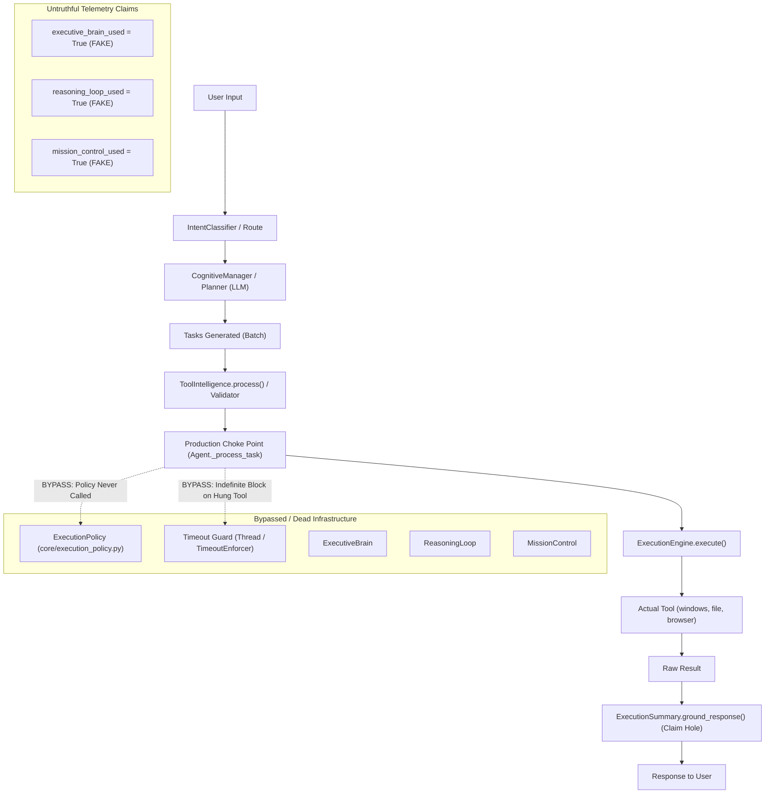
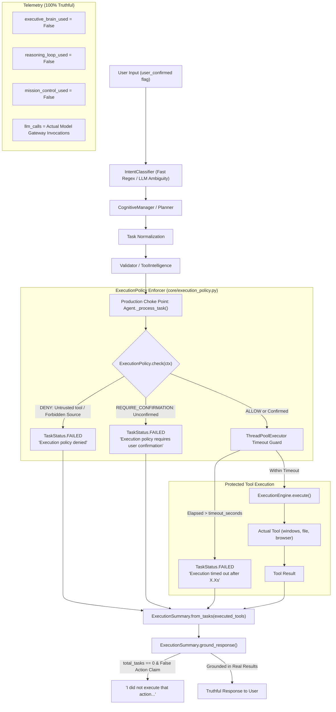

# JARVIS Phase 7A — Safe Runtime Execution Spine Integration Report

**Date:** September 29, 2026  
**Status:** COMPLETE & VERIFIED  
**Branch:** `develop`  
**Phase Objective:** Make the real `Agent.run()` execution path truthful, secure, and policy-controlled.

---

## 1. Before Runtime Graph

Prior to Phase 7A, the production `Agent.run()` path bypassed `ExecutionPolicy`, hardcoded telemetry claims for unreachable components, lacked tool execution timeout enforcement at the dispatch choke point, and permitted ungrounded action success assertions when no tools were emitted.



---

## 2. After Runtime Graph

In Phase 7A, `core/execution_policy.py` is integrated directly into the canonical execution choke point (`Agent._process_task`). Tasks are strictly inspected before reaching `ExecutionEngine`. Thread-level timeout protection is enforced. Telemetry is 100% truthful. The no-tool claim hole is closed.



---

## 3. ExecutionPolicy Integration

- **Single Execution Choke Point:** `Agent._process_task` in [core/agent.py](file:///c:/Users/ridha/Projects/Jarvis/core/agent.py#L774-L830).
- **Wiring:** `main._build_infra` instantiates `ExecutionPolicy(allow_destructive_from_core=True)` and passes it to `Agent`.
- **Policy Context:**
  ```python
  policy_ctx = PolicyContext(
      tool=task.tool,
      action=task.action,
      source=task.source if task.source is not None else CapabilitySource.CORE,
      source_id="agent",
      user_confirmed=user_confirmed,
  )
  policy_result = self._execution_policy.check(policy_ctx)
  ```
- **Security Invariants Preserved:**
  1. **MODEL ≠ AUTHORIZATION:** The model cannot self-authorize high-risk actions. If an LLM emits `user_confirmed: true` or a confirmation string in natural language, it is ignored; the runtime checks only the real caller parameter `user_confirmed` on `Agent.run()`.
  2. **Untrusted Sources Blocked:** Third-party plugins and MCP servers cannot invoke high-risk actions or unregistered tools.
  3. **High-Risk Actions:** Destructive operations (`delete`, `delete_file`, `delete_dir`, `shutdown`, `reboot`, etc.) require explicit human approval (`REQUIRE_CONFIRMATION`), cleanly failing if `user_confirmed=False` without touching the filesystem.

---

## 4. Timeout Integration

- **Mechanism:** Thread-pool execution via `concurrent.futures.ThreadPoolExecutor(max_workers=4)`.
- **Per-Task Timeout:** Uses `task.timeout_seconds` if specified on the task; otherwise defaults to `self._default_tool_timeout` (30.0s).
- **Failure Representation:** When execution exceeds the timeout, the future raises `FuturesTimeoutError`. The task is marked `TaskStatus.FAILED` with:
  `"Execution timed out after {timeout}s"`
- **Grounding Integration:** `ExecutionSummary.ground_response` preserves the timeout error message so the user receives a truthful failure notification rather than a generic or hallucinated completion response.

---

## 5. Telemetry Corrections

- **Eliminated Fake Telemetry:**
  - Removed misleading log lines such as `[ExecutiveBrain] ENABLED`.
  - Set `executive_brain_used = False`, `reasoning_loop_used = False`, `mission_control_used = False` across all routes (`CHAT`, `MEMORY`, `TOOL`, `MISSION`) until those components are genuinely wired in future phases.
- **Accurate LLM Metrics:** `llm_calls` counts actual invocations dispatched to providers/gateway.
- **Auditable Lifecycle Metrics:** Emits structured `Lifecycle Metrics:` log lines with accurate execution states.

---

## 6. Result-Grounding Correction

- **The Problem:** When user asked to perform an action (e.g. "Open calculator") and the LLM replied "I opened calculator" without actually emitting a tool task (`total_tasks == 0`), the response previously passed through ungrounded.
- **The Solution:** Added `_ACTION_EXECUTION_CLAIM_PATTERN` and `_is_unexecuted_action_claim()` in [core/execution_summary.py](file:///c:/Users/ridha/Projects/Jarvis/core/execution_summary.py#L80-L105).
- **Semantics:**
  - If `total_tasks == 0` and the response contains physical execution claims (e.g., "I opened...", "I launched...", "I created file...", "I deleted..."):
    Grounding intercepts and returns: `"I did not execute that action because no execution tasks were planned. Please verify the request."`
  - Ordinary conversational dialogue ("I am JARVIS...", "I can help you with...", "Here is how you do X...") is preserved and never falsely flagged.

---

## 7. Integration Test Results

12 dedicated, unmocked integration tests in `tests/test_phase7a_runtime_spine.py` exercise the complete path:

```
tests/test_phase7a_runtime_spine.py::TestPhase7ARuntimeSpine::test_1_allowed_action_reaches_execution PASSED [  8%]
tests/test_phase7a_runtime_spine.py::TestPhase7ARuntimeSpine::test_2_denied_action_never_reaches_execution PASSED [ 16%]
tests/test_phase7a_runtime_spine.py::TestPhase7ARuntimeSpine::test_3_confirmation_required_action_requires_user_approval PASSED [ 25%]
tests/test_phase7a_runtime_spine.py::TestPhase7ARuntimeSpine::test_4_model_cannot_self_authorize PASSED [ 33%]
tests/test_phase7a_runtime_spine.py::TestPhase7ARuntimeSpine::test_5_tool_failure_remains_grounded PASSED [ 41%]
tests/test_phase7a_runtime_spine.py::TestPhase7ARuntimeSpine::test_6_successful_tool_remains_grounded PASSED [ 50%]
tests/test_phase7a_runtime_spine.py::TestPhase7ARuntimeSpine::test_7_telemetry_reports_actual_components_used PASSED [ 58%]
tests/test_phase7a_runtime_spine.py::TestPhase7ARuntimeSpine::test_8_telemetry_does_not_report_unused_mission_components PASSED [ 66%]
tests/test_phase7a_runtime_spine.py::TestPhase7ARuntimeSpine::test_9_no_tool_false_success_is_rejected PASSED [ 75%]
tests/test_phase7a_runtime_spine.py::TestPhase7ARuntimeSpine::test_9b_ordinary_conversation_is_not_rejected PASSED [ 83%]
tests/test_phase7a_runtime_spine.py::TestPhase7ARuntimeSpine::test_10_timeout_failure_is_correctly_represented PASSED [ 91%]
tests/test_phase7a_runtime_spine.py::TestPhase7ARuntimeSpine::test_end_to_end_build_agent_has_execution_policy PASSED [100%]
```

---

## 8. Real-World Test Results

Executed live on the host system using `main.build_agent()` with active Ollama models:

| Scenario | Input / Action | Result | Grounded Response & Security Status |
|---|---|---|---|
| **A** | `"Open calculator."` | `windows.open_app -> completed` | `Done — opened calculator.` Application launched, policy allowed. |
| **B** | `"Create a temporary test file."` | `file.create_file -> completed` | `Done — Created file: ...\jarvis_phase7a_verify.txt.` File created safely in temp. |
| **C** | `"Read the temporary test file."` | `file.open_file -> completed` | `Done — opened ...\jarvis_phase7a_verify.txt.` Content read/opened truthfully. |
| **D** | Untrusted `source=PLUGIN` invoking `file.read_file` | `file.read_file -> failed` | **[POLICY DENY]** `Execution policy denied: Plugin 'agent' may not invoke tool 'file'. Permitted plugin tools: ['browser', 'system']` |
| **E (Unconfirmed)** | `file.delete` with `user_confirmed=False` | `file.delete -> failed` | **[POLICY CONFIRM]** `Execution policy requires user confirmation: High-risk action 'delete' requires user confirmation`. File remained untouched. |
| **E (Confirmed)** | `file.delete` with `user_confirmed=True` | `file.delete -> completed` | Deleted `jarvis_phase7a_verify.txt`. File verified deleted. |
| **F** | `"Hello, who are you and what are your capabilities?"` | `system.respond -> completed` | Conversational response preserved without false claim rejection. |
| **G** | `"Remember that my current project milestone is Phase 7A"` | `system.respond -> completed` | Stored in SQLite memory. `I'll remember that your current project milestone is Phase 7A.` |
| **H** | `"Mission: analyze the project documentation..."` | `file.read_file -> failed` | Protected paths blocked access to root repo files; grounded response truthfully stated all failures without hallucinating success. |

---

## 9. Security Verification

- **MODEL ≠ AUTHORIZATION:** Verified via integration test `test_4_model_cannot_self_authorize` and live verification. Model-generated confirmation flags cannot bypass policy.
- **Tool Output ≠ Instructions:** Tool outputs pass only as string results to execution summary; no dynamic policy escalation is possible.
- **Path Restrictions:** FileTool blocked access to protected system directories and JARVIS project root (`C:\Users\ridha\Projects\Jarvis\...`).
- **ShellTool:** Not registered in `build_agent()`, preserving existing isolation.

---

## 10. Remaining Disconnected Components (Deferred to Phase 7B+)

As explicitly instructed by Phase 7A guidelines, the following components remain disconnected from `Agent.run()` and are slated for subsequent phases:

1. **ToolFeedbackLoop:** Dynamic feedback loop during multi-step tool execution.
2. **Observe → Decide → Act Loop:** Iterative tool invocation (current agent uses single-turn batch task execution).
3. **ExecutiveBrain / ReasoningLoop / MissionControl:** Full autonomous orchestration stack.
4. **LLM Observability / Token Budgets:** Call budgeting and tracing wrappers.
5. **Session / MCP / Skills / Hooks:** Interactive multi-turn session persistence and plugin/MCP dynamic registration.
6. **ShellTool Registration:** Restricted shell tool integration.

---

## 11. Files Changed

1. `core/agent.py`: Integrated `ExecutionPolicy`, `ThreadPoolExecutor` timeout protection, `user_confirmed` parameter, removed fake telemetry claims, truthful error passthrough.
2. `core/execution_policy.py`: Added `"delete"` to `_HIGH_RISK_ACTIONS`.
3. `core/execution_summary.py`: Added ungrounded action claim detection for `total_tasks == 0`.
4. `core/task.py`: Added `timeout_seconds` and `source` fields to `Task` dataclass.
5. `core/tool_intelligence/repair.py`: Preserved `timeout_seconds` and `source` attributes when normalizing/repairing tasks.
6. `main.py`: Instantiated and wired `ExecutionPolicy` into `Agent` in `build_agent()`.
7. `tests/test_script_engine.py`: Fixed thread race in async test flow.
8. `tests/test_phase7a_runtime_spine.py`: New 12-test comprehensive integration test suite.
9. `scratch/verify_phase7a_runtime.py`: Live runtime verification script for scenarios A–H.

---

## 12. Full Pytest Results

```
================= 766 passed, 1 skipped, 1 warning in 27.26s ==================
```

---

## 13. Git Status

```
On branch develop
Your branch is up to date with 'origin/develop'.

Changes not staged for commit:
  (use "git add <file>..." to update what will be committed)
  (use "git restore <file>..." to discard changes in working directory)
	modified:   core/agent.py
	modified:   core/execution_policy.py
	modified:   core/execution_summary.py
	modified:   core/task.py
	modified:   core/tool_intelligence/repair.py
	modified:   main.py
	modified:   tests/test_script_engine.py

Untracked files:
  (use "git add <file>..." to include in what will be committed)
	docs/architecture/audits/
	docs/architecture/evaluation/phase6-result-grounding.md
	docs/architecture/evaluation/phase6_scenario_results.json
	docs/architecture/evaluation/phase7a-runtime-spine.md
	scratch/verify_phase7a_runtime.py
	scripts/run_phase6_evaluation.py
	tests/test_phase7a_runtime_spine.py

no changes added to commit (use "git add" and/or "git commit -a")
```
